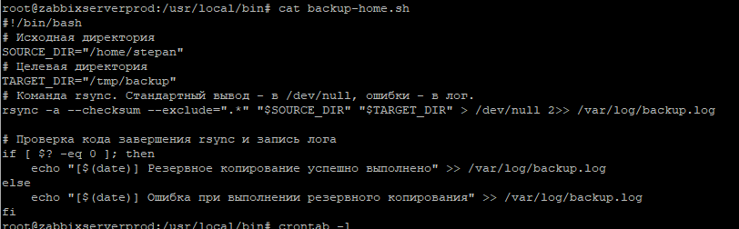
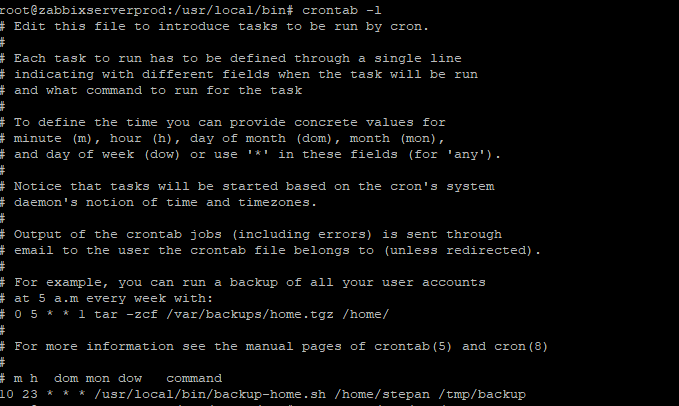
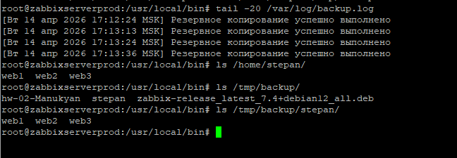

# Домашнее задание к занятию "`Резервное копирование`" - `Манукян Степан`


### Задание 1

`Приведите ответ в свободной форме........`

'Составьте команду rsync, которая позволяет создавать зеркальную копию домашней директории пользователя в директорию /tmp/backup'
'Необходимо исключить из синхронизации все директории, начинающиеся с точки (скрытые)'
'Необходимо сделать так, чтобы rsync подсчитывал хэш-суммы для всех файлов, даже если их время модификации и размер идентичны в источнике и приемнике.'
'На проверку направить скриншот с командой и результатом ее выполнения'

```
Поле для вставки кода...
root@zabbixserverprod:~# mkdir -p /tmp/backup
root@zabbixserverprod:~# rsync -avzh --delete --exclude='.*/' --checksum ~/ /tmp/backup/

```

`Результат работы команды`


`Сравнение файлов`


---


### Задание 2


'Написать скрипт и настроить задачу на регулярное резервное копирование домашней директории пользователя с помощью rsync и cron.'
'Резервная копия должна быть полностью зеркальной'
'Резервная копия должна создаваться раз в день, в системном логе должна появляться запись об успешном или неуспешном выполнении операции'
'Резервная копия размещается локально, в директории /tmp/backup'
'На проверку направить файл crontab и скриншот с результатом работы утилиты.'

```
скрипт

#!/bin/bash
# Исходная директория
SOURCE_DIR="/home/stepan"
# Целевая директория
TARGET_DIR="/tmp/backup"
# Команда rsync. Cтандартный вывод - в /dev/null, ошибки - в лог.
rsync -a --checksum --exclude=".*" "$SOURCE_DIR" "$TARGET_DIR" > /dev/null 2>> /var/log/backup.log

# Проверка кода завершения rsync и запись лога
if [ $? -eq 0 ]; then
    echo "[$(date)] Резервное копирование успешно выполнено" >> /var/log/backup.log
else
    echo "[$(date)] Ошибка при выполнении резервного копирования" >> /var/log/backup.log
fi

```
Скрипт


Cron


Проверка



